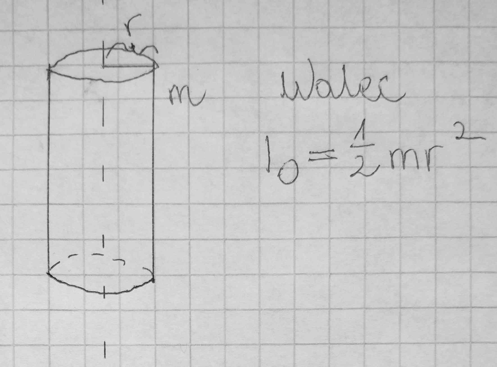
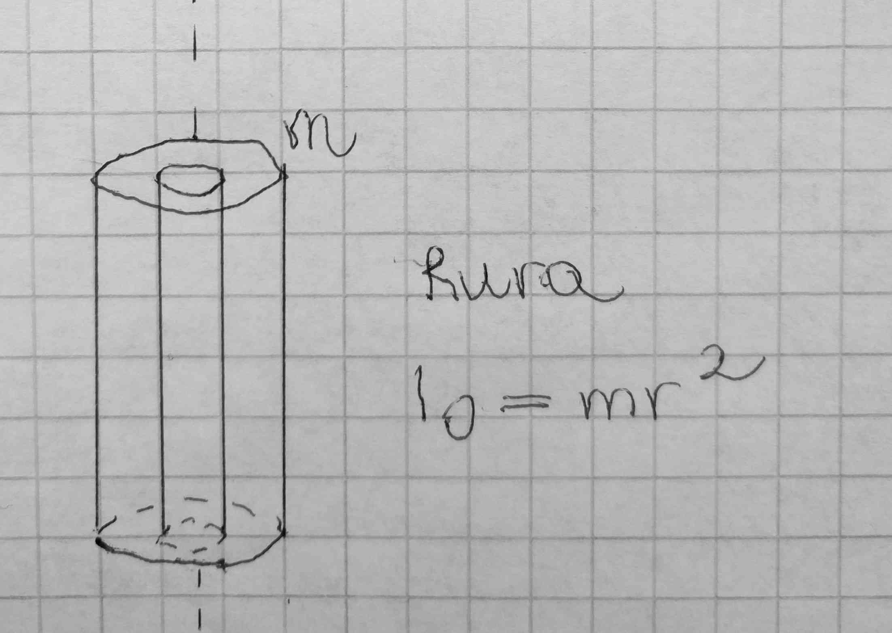

# Bryła sztywna

Jest to ciało którego poszczególne części są w stałych odległościach od siebie, pomimo działających sił np. stalowy pręt, kula.

Prędkość obrotowa punktów jest taka sama, prędkość liniowa, tym mniejsza, im bliżej do osi obrotu.

## Wzory na ruch obrotowy

Wzory na ruch obrotowy dostajemy, przekształcając jednostki z ruchu postępowego, na ich odpowiedniki w ruchu obrotowym.

- Jednostajny

$v = \frac{s}{t}$ => $\omega = \frac{\alpha}{t}$

$s = vt$ => $\alpha = \omega t$

- Jednostajnie przyspieszony

$v = v_0 + at$ => $\omega = \omega_0 + \epsilon t$

$s= v_0t +\frac{at^2}{2}$ => $\alpha = w_0t + \frac{\epsilon t^2}{2}$

- Jednostajnie opóźniony

$v = v_0 - at$ => $\omega = \omega_0 - \epsilon t$

$s=v_0t - \frac{at^2}{2}$ => $\alpha = \omega_0 t - \frac{\epsilon t^2}{2}$

---

$a = \frac{\Delta v}{t}$ => $\epsilon = \frac{\Delta \omega}{t}$

$\epsilon[\frac{rad}{s^2}] = [\frac{1}{s^2}]$

$v = \omega R$

$a = \epsilon R$

## Moment bezwładności

$I[kgm^2]$

Informuje o tym jak masa jest rozmieszczona względem osi obrotu. (Zastępuje masę.)

### Moment bezwładności układu punktów materialnych

$I = m_1r_1^2+m_2r_2^2+...$

Okręgi 1, 2, 3 symbolizują punkty materialne (obiekty bezwymiarowe). Podczas obrotu walca punkty 1 i 2 przyczyniają się do zwiększenia momentu bezwładności walca, w przeciwieństwie do punktu 3 który leży na osi obrotu.

### Moment bezwładności wybranych brył sztywnych

- względem osi przechodzącej przez środek masy

  
  
  
  

- względem osi nieprzechodzącej przez środek masy (Twierdzenie Steinera)

  $I=I_0+md^2$

  d-najmniejsza odległość między osią obrotu, a osią przechodzącą przez środek masy.
