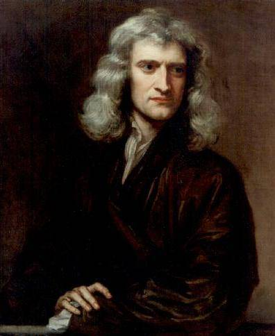

# Zasady dynamiki Newtona

Dynamika rozważa przyczyny ruchu i analizuje siły działające na ciało w danym układzie. Do najważniejszych praw z zakresu dynamiki należą trzy zasady dynamiki, sformułowane przez Isaaca Newtona (1642–1727)

Sformułowanie przez Newtona trzech zasad dynamiki było jednym z jego największych osiągnięć i przyczyniło się do jego wielkiej sławy w świecie nauki. Dopiero dokonania fizyki współczesnej pokazują, iż prawa newtonowskie pozwalają tylko na opis ruchu ciał poruszających się z prędkościami znacznie mniejszymi od prędkości światła, o rozmiarach znacząco większych niż rząd wielkości rozmiarów molekuł (około $10^{−9}m$ średnicy).

## Definicja siły

Zanim przejdziemy do zdefiniowania zasad dynamiki, należy wprowadzić podstawową definicję siły. Pomóc w zrozumieniu pojęcia siły może wyobrażenie sobie dość prostej sytuacji, w której raz ciągniemy, a raz pchamy jakieś ciało. Czynności te można opisać, podając wielkość (wartość) oraz kierunek przyłożonej do ciała siły. Widać stąd, że mamy do czynienia z wektorem. Możemy więc zdefiniować siłę jako ilościowy opis czynności pchania lub ciągnięcia pewnego obiektu, uwzględniający odpowiednie cechy, takie jak wielkość przyłożonej siły bądź jej kierunek. Siła opisywana jest jako wektor lub jako wielokrotność pewnej siły jednostkowej.

W przypadku czynności popychania bądź ciągnięcia ciała rozpatrywać należy wielkość przyłożonej siły oraz jej kierunek. Dla przykładu, działo wywiera ogromną siłę na wystrzeliwany w powietrze pocisk, natomiast Ziemia wywiera bardzo niewielki nacisk na żyjącą na niej pchłę. Nasze codziennie doświadczenia pozwalają nam zrozumieć, jak wiele sił nas otacza. Gdy dwoje ludzi popycha trzeciego człowieka w różnych kierunkach, jak to pokazano na rysunku poniżej, całkowita siła będzie miała kierunek zgodny z tym oznaczonym jako $F_w$
– siła wypadkowa. Siły, jak wszystkie wektory, oznaczane są jako strzałki, a ich dodawanie można wykonać za pomocą klasycznej metody dodawania geometrycznego wektorów lub z użyciem odpowiednich funkcji trygonometrycznych.

Przykład (b) na rysunku ukazuje diagram przedstawiający rozkład sił działających na ciało, uwzględniający wszystkie siły działające na analizowany obiekt. Jak widać, ciało przedstawiono jako pojedynczy punkt, do którego przyłożono siły, będące siłami zewnętrznymi. Jedynie siły zewnętrzne są przyczyną ruchu danego obiektu. Wszelkie siły wewnętrzne w układzie są w tym przypadku zaniedbywane. Wyżej wspomniane siły zewnętrzne są wielkościami wektorowymi, mającymi zwrot od punktu przyłożenia analizowanego ciała na zewnątrz.

### Siła jako wektor

Siła jest wielkością wektorową. Posiada wartość, kierunek i zwrot. Jednostką siły w układzie SI jest niuton (ang. newton), oznaczany jako N. Siła $1N$ jest to siła potrzebna, aby ciału o masie 1 kg nadać przyspieszenie $1\frac{m}{s^2}$: $1N=\frac{1kg⋅m}{s^2}$. Łatwo zapamiętać, czym jest niuton, utożsamiając taką wartość z ciężarem jabłka ($F_c$ wynosi wówczas około 1 N).

## Zasady dynamiki Newtona

1. Jeżeli na ciało nie działają siły zewnętrzne lub działające siły równoważą się, to ciało pozostaje w spoczynku lub porusza się ruchem jednostajnym prostoliniowym.

Na podstawie wielu różnych eksperymentów wykazano, że gdy nie działa żadna siła zewnętrzna, to ciało pozostaje w spoczynku, lub kontynuuje ruch jednostajny.

Piłka po wprawieniu w ruch, toczyłaby się bez końca jeśli nie byłoby tarcia.

Cechy sił równoważących

- kierunek: taki sam
- wartość: taka sama
- punkt przyłożenia: taki sam
- zwrot: przeciwny

2. Jeżeli na ciało działa stała niezrównoważona siła, to porusza się ono ruchem jednostajnym przyspieszonym lub ruchem jednostajnym opóźnionym z przyspieszeniem wprost proporcjonalnym do działającej siły a odwrotnie proporcjonalnej do masy ciała.

   $a = \frac{F_w}{m}$ $=>$ $F_w = ma$

Najczęściej używany wzór to $F_w = ma$ lecz jest również wzór zawierający pęd. (Więcej o pędzie w temacie Zasada zachowania pędu)

$a = \frac{F_w}{m}$

$F_w = ma$

$a = \frac{\Delta v}{t}$

$F_w = \frac{m\Delta v}{t} = \frac
{\Delta p}{t}$

3. Jeżeli ciało A działa na ciało B pewną siłą to ciało B działa na ciało A siłą o tym samym kierunku, tej samej wartości i przeciwnym zwrocie.

Cechy tych sił:

- kierunek: taki sam
- wartość: taka sama
- punkt przyłożenia: inny
- zwrot: przeciwny

Wyobraźmy sobie pływaczkę odbijającą się od ściany basenu (Rysunek). Odpycha się ona stopami od ściany basenu i płynie w kierunku przeciwnym do zwrotu siły, z którą, odbijając się, zadziałała na ścianę. Podczas odbijania ściana basenu reaguje na stopy pływaczki siłą o przeciwnym zwrocie, lecz równej wartości. Na pierwszy rzut oka wydaje się, że siły te się równoważą. Jednak tak się nie dzieje, ponieważ działają one na różne układy.

::: tip
Koniecznie zapamiętaj te zasady, będą potrzebne w zadaniach.
:::

## Zadanie z II zasadą.

### Jakie przyspieszenie może nadać człowiek kosiarce?

Załóżmy, że siła wypadkowa (siła, z którą pchana jest kosiarka, minus siła tarcia) wywierana na kosiarkę wynosi 51 N, a jej kierunek jest równoległy do podłoża (Rysunek). Masa kosiarki wynosi 24 kg. Jakie przyspieszenie uzyskała kosiarka?

(a) Siła wypadkowa działająca na kosiarkę skierowana jest w prawą stronę i wynosi 51 N. Jak bardzo kosiarka przyspiesza? (b) Rozkład sił działających na kosiarkę.

Dana jest: $F_{wyp}$ oraz masa $m$, więc przyspieszenie ciała można obliczyć bezpośrednio z równania: $F_{wyp}=ma$.

### Rozwiązanie

Wartość przyspieszenia $a$
wynosi $a=\frac{F_{wyp}}{m}$. Wstawiając wartości liczbowe, otrzymujemy:
$a=\frac{51N}{24kg}=2,13\frac{m}{s^2}$.

Zamieniamy jednostkę:
$[a]=\frac{kg⋅\frac{m}{s^2}}{kg}=\frac{m}{s^2}$.

## Sprawdź czy rozumiesz!

Czy siły akcji i reakcji równoważą się wzajemnie?
::: warning Pomyśl
Odpowiedź poniżej.
:::

:arrow_double_down:

:arrow_down_small:

:warning:

Nie, ponieważ mają inne punkty przyłożenia.

## Symulacja sił w ruchu

<iframe src="https://phet.colorado.edu/sims/html/forces-and-motion-basics/latest/forces-and-motion-basics_pl.html" width="100%" height="400" scrolling="no" allowfullscreen></iframe>

Zwróć uwagę na przypadek z tarciem, gdzie w momencie gdy ciało zaczyna się ruszać, tarcie maleje. Więcej o tarciu statycznym i kinetycznym już wkrótce.

\*
Na podstawie: Katalyst Education, [Fizyka dla szkół wyższych.](http://cnx.org/contents/4eaa8f03-88a8-485a-a777-dd3602f6c13e@1.144) Tom 1. OpenStax CNX. Aug 9, 2019
