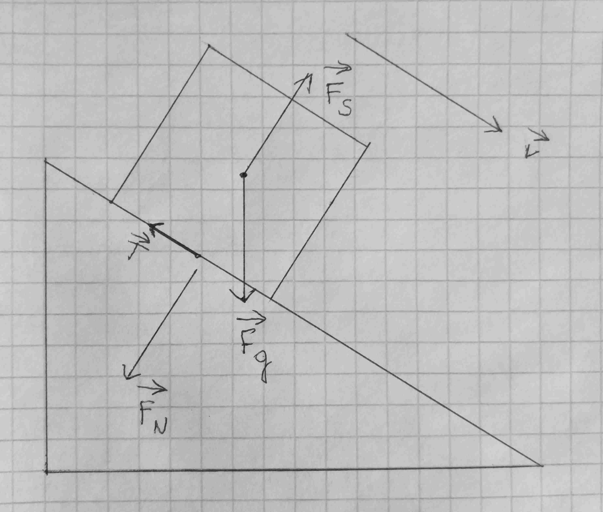

# Równia pochyła

## Siły działająca na klocek na równi pochyłej

Tak jak w poprzednim temacie, na klocek działa siła grawitacji, siła sprężystości (reakcji) i siła tarcia. Klocek działa na równię siłą nacisku.

Rozłóżmy siłę grawitacji na składową $x$ i $y$. Mamy dwa trójkąty podobne z takim samym kątem alpha. Rozpiszmy funkcje sinusów i cosinusów.

Po uporządkowaniu otrzymujemy wzory:

- $F_z = F_gsin \alpha = mgsin \alpha$
- $F_N = F_{gy} = F_gcos\alpha = mgcos \alpha$
- $T = fF_N = fmgcos \alpha$

Wzory na siłę zsuwu i tarcie będą często potrzebne do zadań.
