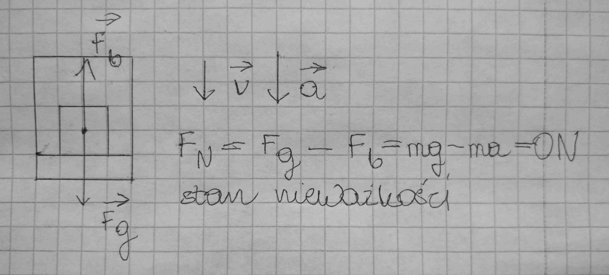

# Układ inercjalny i nieinercjalny

## Inercjalny układ odniesienia

To taki układ w którym spełnione są zasady dynamiki. Zaliczamy do nich układy:

- spoczywające np. stojący na parkingu samochód
- poruszające się ruchem jednostajnym prostoliniowym

## Nieinercjalny układ odniesienia

To taki układ w którym zasady dynamiki nie są spełnione. Zaliczamy do nich układy:

- poruszające się ruchem przyspieszonym i opóźnionym np. hamujący samochód
- będące ruchem po okręgu

### Siła bezwładności

Aby w układzie nieinercjalnym zasady dynamiki były spełnione, wprowadzamy dodatkową siłę zwaną siłą bezwładności, skierowaną zawsze przeciwnie do wektora przyspieszenia układu.

$Fb = ma$

### Stany w układach nieinercjalnych

Na przykładzie windy przyspieszającej lub hamującej.

- Przeciążenie - przyspieszenie skierowane w górę. Siła nacisku klocka większa niż w spoczynku.

- Niedociążenie - przyspieszenie skierowane w dół. Klocek waży mniej niż w spoczynku.

- Nieważkość - przyspieszenie skierowane w dół, "wytwarza" siłę bezwładności skierowaną w górę, równą sile grawitacji.

