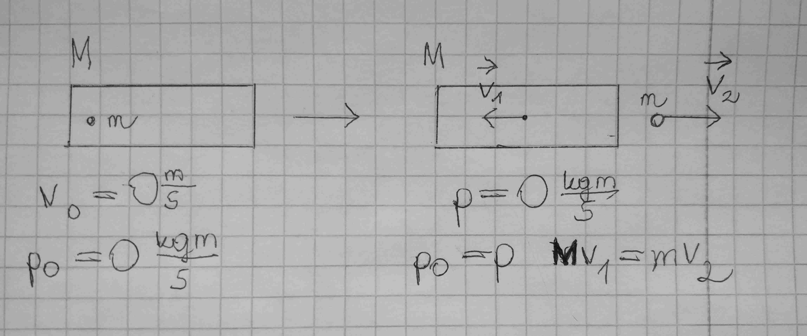

# Pęd. Zasada zachowania pędu

## Wzór na pęd

Pęd $\vec p$ ciała jest iloczynem jego masy $m$ i prędkości $\vec v$. Pęd jest wielkością wektorową o kierunku i zwrocie zgodnym z wektorem prędkości.

$p = mv$

## Zasada zachowania pędu

Wyobraźmy sobię sytuację w której samochód uderza w samochód jadący przed nim. W rezultacie pierwszy samochód zwalnia, a drugi przyspiesza. Pęd każdego samochodu z osobna ulega zmianie, ale całkowity pęd dwóch samochodów jest taki sam przed kolizją i po kolizji (przy założeniu, że tarcie jest pomijalne).

Źródło ilustracji: [OpenStax CNX](http://cnx.org/contents/031da8d3-b525-429c-80cf-6c8ed997733a@17.2).

::: tip Zasada zachowania pędu
Jeżeli na układ nie działa siła zewnętrzna (mamy do czynienia z układem odosobnionym) to pęd układu jest stały.

$p_0 = p_k$
:::

## Zderzenia

- niesprężyste

Po zderzeniu ciała poruszają się wspólnie. Przykleiły się do siebie.

::: tip Zasada:

- zachowania pędu
  :::

- sprężyste

Po zderzeniu ciała poruszają się oddzielnie. Odbiły się od siebie.

::: tip Zasada:

- zachowania pędu
- zachowania energii mechanicznej
  :::

## Zjawisko odrzutu

Na ilustracji przedstawiono rakietę przed i po wyrzuceniu pocisku.

Po lewej stronie zarówno rakieta jak i pocisk pozostają w spoczynku. Prędkość i pęd równe 0.

Po prawej stronie sytuacja po wyrzuceniu pocisku. Pęd rakiety i pocisku uległ zmianie, lecz całego układu pozostaje stały i jest równy 0$\frac{kgm}{s}$.

\*
Na podstawie: Katalyst Education, [Fizyka dla szkół wyższych.](http://cnx.org/contents/4eaa8f03-88a8-485a-a777-dd3602f6c13e@1.144) Tom 1. OpenStax CNX. Aug 9, 2019
