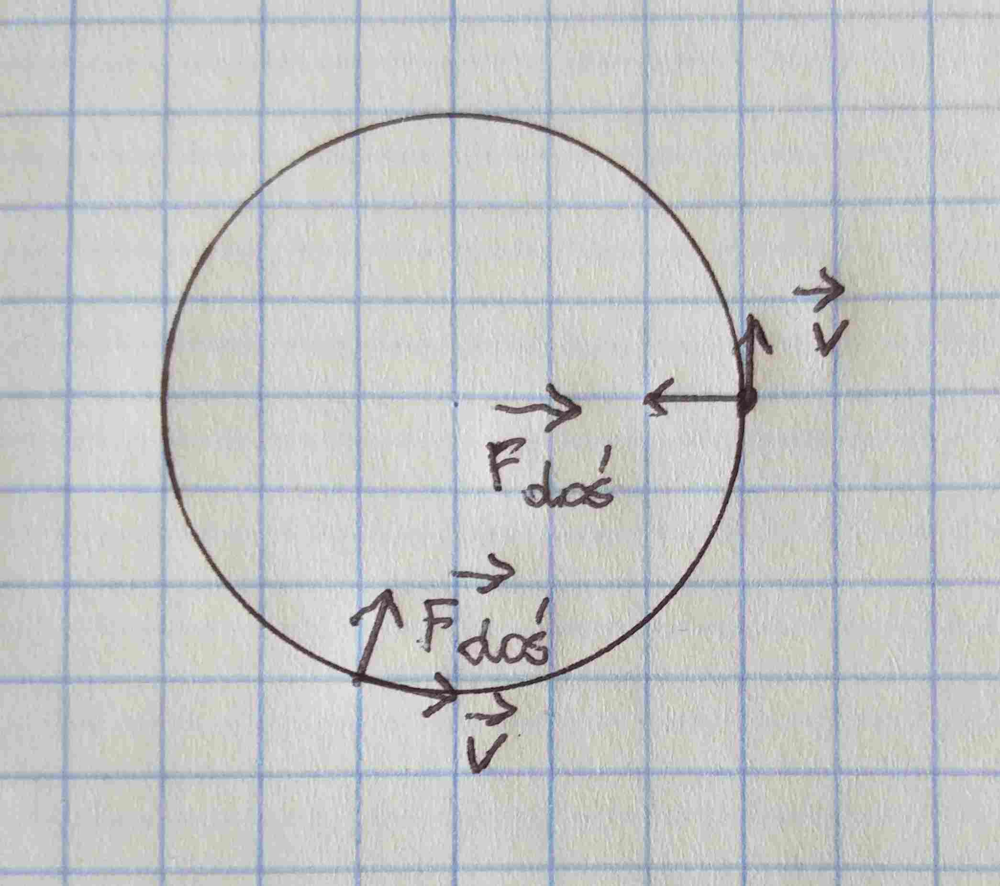
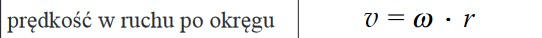

# Ruch jednostajny po okręgu

## Siła dośrodkowa

Na ciało poruszające się w ten sposób działa siła dośrodkowa, skierowana do środka okręgu pod kątem prostym do wektora prędkości.

Jest ona siłą wypadkową (więcej o tym w dziale dynamika) więc wzór na nią to $F_w = ma$ gdzie $a$ - przyspieszenie dośrodkowe

$F_{doś} = ma_{doś}$

A zgodnie z kartą wzorów:

Podstawiając za $a$:

$F_{doś} = \frac{mv^2}{r}$

Wszystkie jednostki po prawej stronie równania są stałe, więc siła jest również stała.

## Prędkość

$v = \frac{s}{t}$

gdzie $s$ to obwód okręgu $s = 2\pi r$

$t$ - czas jednego okrążenia $t = T$

$v = \frac{2\pi r}{T} = 2\pi rf$

$T = \frac{1}{f}$

## Prędkość kątowa

Prędkość kątowa $\omega$ (omega) jest to iloraz zatoczonego kąta przez czas. Zwróćmy uwagę na podobieństwo wzoru liniowego z kątowym.

$v = \frac{s}{t}$

Analogicznie:

$\omega = \frac{\Delta \alpha}{\Delta t}$

$\alpha$ - zatoczony kąt w radianach $360° = 2 \pi$rad

$\omega = \frac{\alpha}{t} = \frac{2 \pi}{T} = 2\pi f$

$T$ - okres, $f$ - częstotliwość

### Zależność prędkości liniowej od kątowej

## Okres i częstotliwość

- Okres $T[s]$ - czas zatoczenia jednego pełnego okęgu
- Częstotliwość $f[Hz, \frac{1}{s}]$ ilość obrotów w danym czasie
