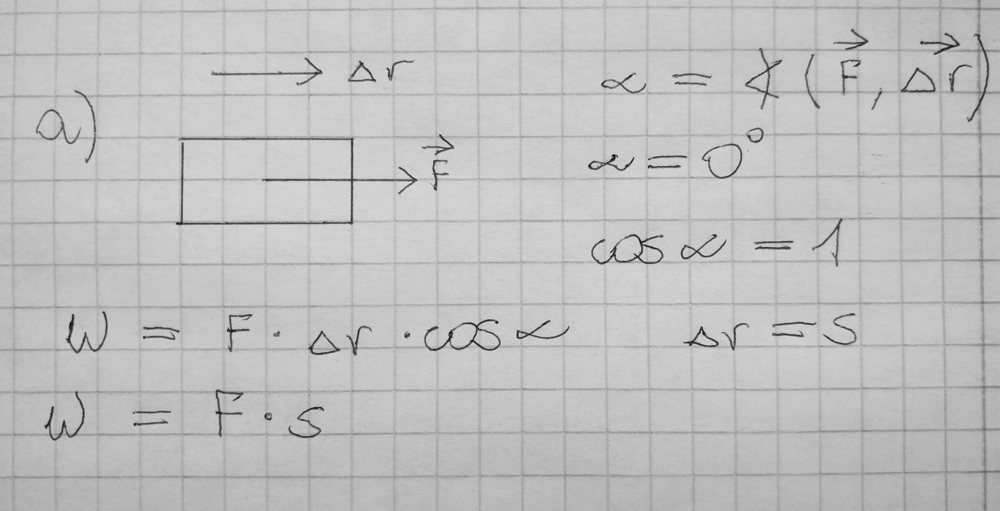
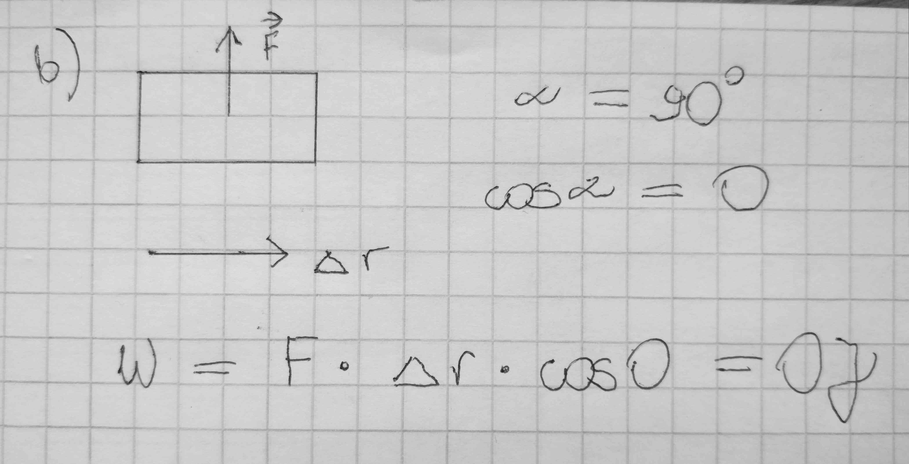
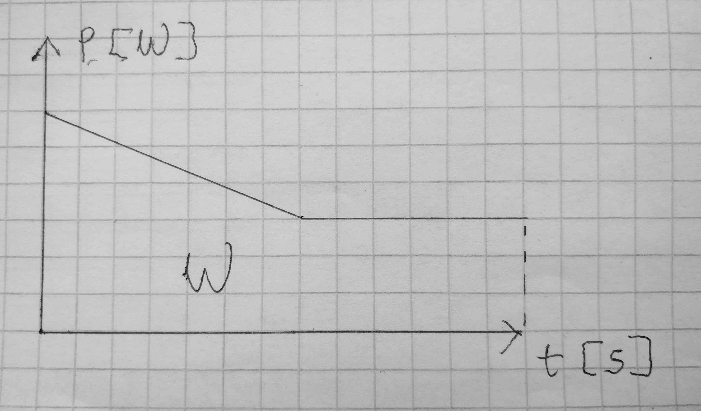
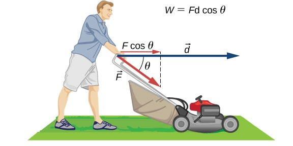

# Praca, moc, energia

## Praca

W fizyce praca oznacza jedną z możliwych form energii. O pracy mówimy wtedy, gdy siła działająca na dane ciało powoduje jego przemieszczenie.

### Wzór na pracę

$W = F\triangle rcos\alpha$

$\alpha$ to kąt między wektorem siły a wektorem przesunięcia:

$\alpha = \sphericalangle (\vec{F}, \vec{\triangle r})$

$W[Nm]=[J]=[\frac{kgm^2}{s}]$

Analizujemy zawsze przeniesienie środka ciężkości danego ciała.

### Przykłady

W pierwszym przykładzie działamy siłą w prawo, równolegle do przesunięcia. Kąt $\alpha$ między siłą a przesunięciem wynosi 0 stopni.

W drugim przykładzie kąt między siłą a przesunięciem wynosi 90 stopni.

Niosąc walizkę w ten sposób, nie wykonujemy pracy, ponieważ nie działamy siłą w kierunku przesunięcia.

W tym przypadku rozpędzone ciało porusza się w prawo, siła tarcia je hamuje mając przeciwny zwrot co przesunięcie. Praca jest ujemna.

### Wykresy pracy

Pracę możemy również obliczyć, mając dany wykres siły od drogi lub mocy od czasu zgodnie ze wzorami: $W =Fs$, $W=Pt$. Pole pod linią wykresów to praca.

### Ćwiczenie

Obliczanie pracy potrzebnej do przesunięcia kosiarki

Ile pracy zostaje wykonane przy pchaniu kosiarki do trawy (Rysunek) jeżeli mężczyzna przykłada siłę 75,0 N pod kątem 35∘ do poziomu na odcinku 25,0 m ?

Obliczamy pracę podstawiając wartości do wzoru na pracę $W=F\triangle rcos\alpha$
. Siła, kąt i przemieszczenie są dane, więc tylko W jest niewiadomą.

Podstawiając dane wartości:
$W=75⋅25⋅cos35∘=1,54⋅10^3J$.

## Moc

Aby powiązać ze sobą pracę i czas, w którym została wykonana, używamy nowego pojęcia – mocy.

$P = \frac{W}{t}$

$P[\frac{J}{s}]=[W]$ (wat)

## Energia

Rodzaje energii mechanicznej

### Energia kinetyczna

Energia kinetyczna ruchu postępowego jest równa iloczynowi masy $m$ i kwadratu prędkości $v$ podzielonemu przez $2$:

$E_k = \frac{mv^2}{2}$

Energia kinetyczna jest wprost proporcjonalna do masy i do kwadratu prędkości.

$E_k$ ~ $m$ , $E_k$ ~ $v^2$

### Energia potencjalna (ciężkości)

W tym przykładzie zignorujemy siły tarcia i opór powietrza. Podczas wznoszenia się piłki praca sił grawitacji ma znak ujemny, ponieważ przesunięcie pionowe piłki jest dodatnie (piłka się unosi), natomiast siła grawitacji jest skierowana w dół. Zauważmy, że piłka spowalnia w trakcie ruchu w górę, aż do momentu osiągnięcia najwyższego punktu swojego lotu. Ta „utracona” energia kinetyczna jest zamieniana na energię potencjalną grawitacji układu piłka-Ziemia.

Gdy piłka opada w kierunku Ziemi, praca ma znak dodatni, ponieważ zarówno siła, jak i przesunięcie są skierowane w dół. Piłka przyspiesza, co przekłada się na wzrost energii kinetycznej. Energia jest zatem zamieniana z energii potencjalnej grawitacji z powrotem na kinetyczną.

W trakcie lotu piłki w górę energia kinetyczna zamienia się w energię potencjalną grawitacji, podczas lotu w dół energia potencjalna zamienia się w kinetyczną.

$E_p = mgh$

### Energia potencjalna sprężystości

Praca wykonana przez idealną sprężynę, w jednym wymiarze, zależy wyłącznie od stałej sprężystości i kwadratu przemieszczenia.

$E_{ps} = \frac{kx^2}{2}$

k - współczynnik sprężystości charakterystyczny dla materiału
x - o ile zmieniamy długość ciała

Przy dwukrotnym wzroście energii kinetycznej, prędkość wzrasta czterokrotnie.

### Ćwiczenie

Układ składa się ze sprężyny o długości wynoszącej w stanie nierozciągniętym $20 cm$ i stałej sprężystości $4 \frac{N}{cm}$. (a) Jaką energię potencjalną posiada rozciągnięta sprężyna o długości $23 cm$? (b) Jaką energię potencjalną posiada rozciągnięta sprężyna o długości $26 cm$?

Rozwiązanie

1. Odkształcenie sprężyny wynosi $x=23−20=3cm$, więc związana z nim energia potencjalna jest równa $Ep=\frac{1}{2}kx^2=\frac{1}{2}⋅4⋅3^2=0,18J$

2. Sprężyna jest odkształcona na długość $x=26−20=6cm$
   , zatem energia potencjalna wynosi $Ep=\frac{1}{2}kx^2=12⋅4⋅6^2=0,72J$. Wzrost energii w porównaniu do podpunktu (1) jest równy 0,54 J.

## Siła sprężystości

Sprężystość ciał to własność związana z odzyskiwaniem pierwotnego kształtu po usunięciu sił zewnętrznych wywołujących odkształcenie. Ciało odzyskuje swój kształt, ponieważ w układzie działa siła sprężystości, która powoduje powrót do położenia równowagi. Ma ona zwrot przeciwny niż kierunek wychylenia. Relacja między siłą sprężystości a wychyleniem została sformułowana w prawie Hooke’a. W matematycznej formie jest skierowana przeciwnie do odkształcenia ciała i wygląda to następująco:

$F_s = -kx$

## Praca a zmiana energii mechanicznej

Kosztem pracy wykonanej przez siłę wewnętrzną, zamieniamy energię mechaniczną danego ciała.

$W = \triangle E$

Na podstawie: Katalyst Education, [Fizyka dla szkół wyższych.](http://cnx.org/contents/4eaa8f03-88a8-485a-a777-dd3602f6c13e@1.144) Tom 1. OpenStax CNX. Aug 9, 2019
