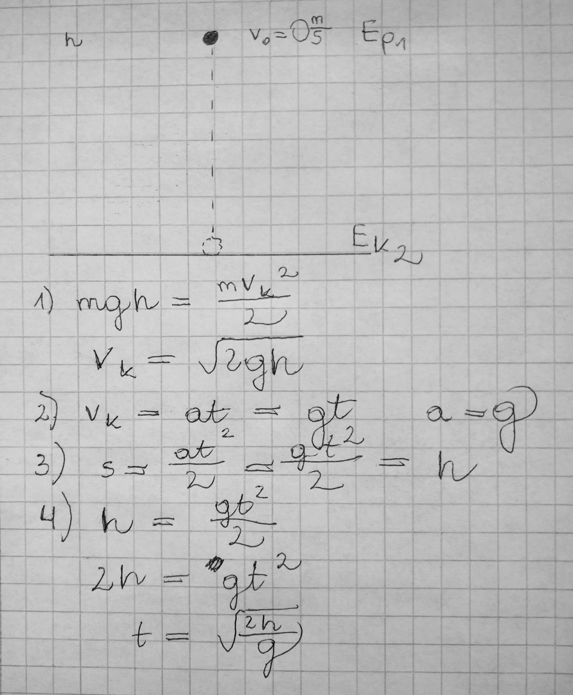
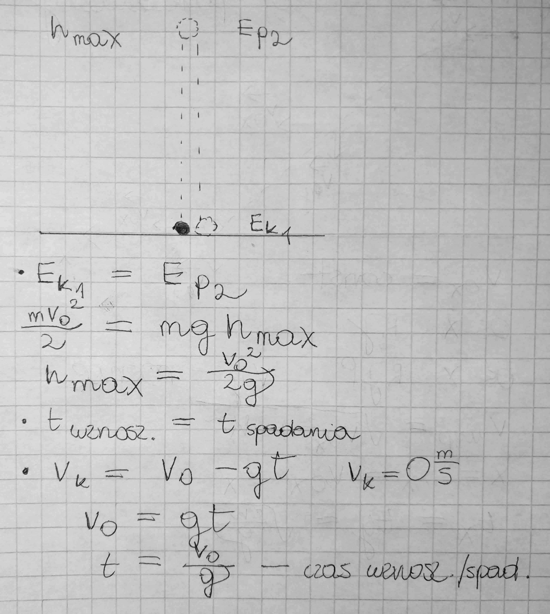

# Spadek swobodny i rzuty

## Spadek swobodny

Zakładamy brak oporów ruchu. W spadku swobodnym, jedyną siłą działającą na ciało jest siła grawitacji.

Zał. $v_0 = 0\frac{m}{s}$

Czarne koło na rysunku oznacza miejsce w którym kulka rozpoczyna ruch. Na zdjęciu opisane są możliwe wzory, których używa się w zadaniach.

## Rzut pionowy do góry

Wyrzucamy kulkę do góry nadając jej prędkość, a tym samym energię kinetyczną, która stopniowo przekształca się w energię potencjalną, tracąc prędkość, zyskując za to na wysokości. Następnie kulka zatrzymuje się, po czym mamy do czynienia ze spadkiem swobodnym.

::: tip Zapamiętaj!
Czas wznoszenia jest taki sam jak czas spadania. Prędkość z którą wyrzucamy kulkę, taka sama jak ta z którą uderza w ziemię.
:::

## Rzut poziomy

Nadajemy kulce prędkość poziomą, którą utrzymuje ona do samego końca, nabierając tym samym prędkości pionowej.

